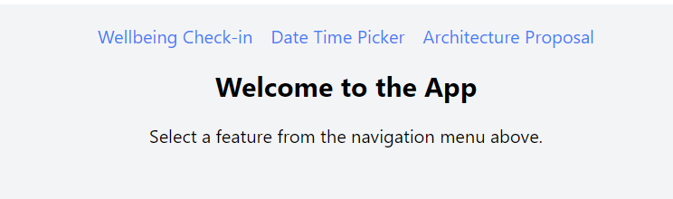
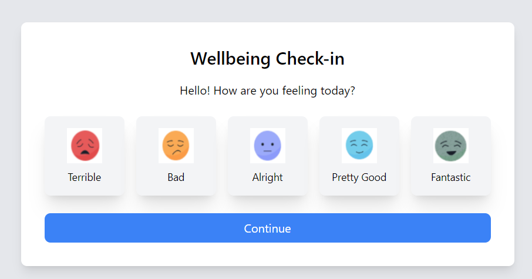
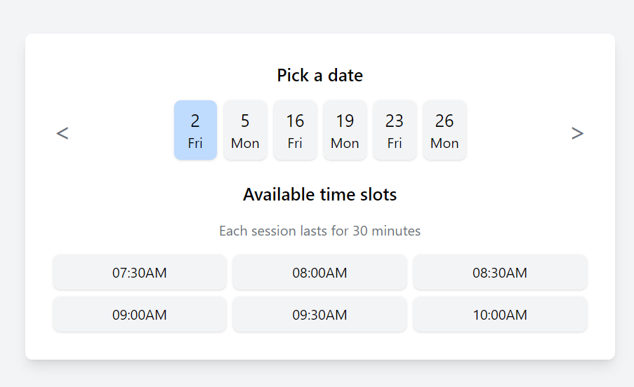

# Getting Started with Create React App

This project was bootstrapped with [Create React App](https://github.com/facebook/create-react-app).

## Available Scripts

In the project directory, you can run:

### `npm start`

Runs the app in the development mode.\
Open [http://localhost:3000](http://localhost:3000) to view it in your browser.

The page will reload when you make changes.\
You may also see any lint errors in the console.

### `npm test`

Launches the test runner in the interactive watch mode.\
See the section about [running tests](https://facebook.github.io/create-react-app/docs/running-tests) for more information.

### `npm run test-coverage`
Launches the test runner in the interactive.
And test covergae is seen.

### User is by default redirected to home page
It contains three links 

### Each link contains answer to the following questions
## Link 1 --> Wellbeing Checkin
 
## Link 2 --> Date TIme Picker
 
## Link 3 --> Architecture Proposal
Downloads the architecture proposal link  
